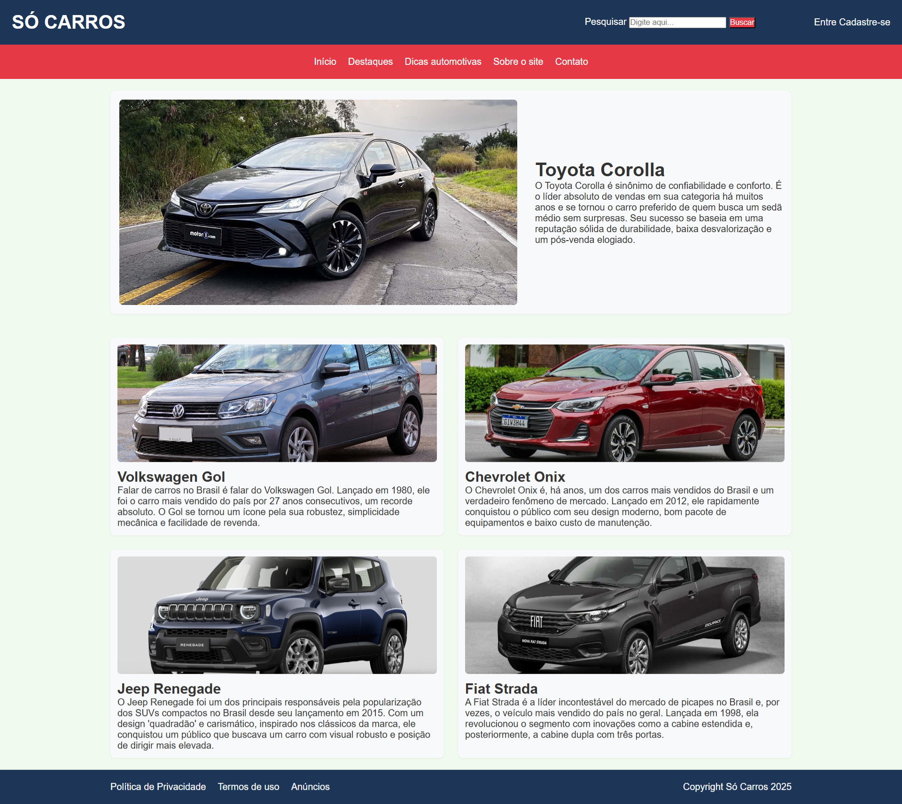
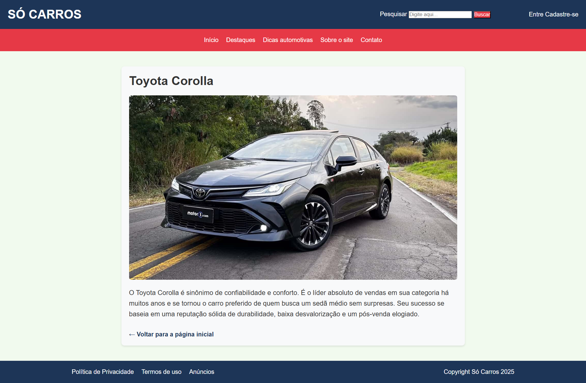

# Trabalho Prático 05 - Semanas 7 e 8

**Páginas de detalhes dinâmicas**

Nessa etapa, vamos evoluir o trabalho anterior, acrescentando a página de detalhes, conforme o  projeto escolhido. Imagine que a página principal (home-page) mostre um visão dos vários itens que existem no seu site. Ao clicar em um item, você é direcionado pra a página de detalhes. A página de detalhe vai mostrar todas as informações sobre o item do seu projeto. seja esse item uma notícia, filme, receita, lugar turístico ou evento.

Leia o enunciado completo no Canvas. 

**IMPORTANTE:** Assim como informado anteriormente, capriche na etapa pois você vai precisar dessa parte para as próximas semanas. 

**IMPORTANTE:** Você deve trabalhar e alterar apenas arquivos dentro da pasta **`public`,** mantendo os arquivos **`index.html`**, **`styles.css`** e **`app.js`** com estes nomes, conforme enunciado. Deixe todos os demais arquivos e pastas desse repositório inalterados. **PRESTE MUITA ATENÇÃO NISSO.**

## Informações Gerais

- Nome: Cesar Lacerda Lima
- Matricula: 897571
- Proposta de projeto escolhida: Um blog automotivo focado em carros.
- Breve descrição sobre seu projeto: Um blog que contém varias informações sobre carros, desde de nóticias, dicas de manutenção, historias, curiosiosades, etc.

## Print da Home-Page



## Print da página de detalhes do item



## Cole aqui abaixo a estrutura JSON utilizada no app.js

```javascript
const carros = [
    {
        id: 1,
        titulo: "Toyota Corolla",
        imagem: "imgs/corolla.jpg",
        descricao: "O Toyota Corolla é sinônimo de confiabilidade e conforto. É o líder absoluto de vendas em sua categoria há muitos anos e se tornou o carro preferido de quem busca um sedã médio sem surpresas. Seu sucesso se baseia em uma reputação sólida de durabilidade, baixa desvalorização e um pós-venda elogiado."
    },
    {
        id: 2,
        titulo: "Volkswagen Gol",
        imagem: "imgs/gol.jpg",
        descricao: "Falar de carros no Brasil é falar do Volkswagen Gol. Lançado em 1980, ele foi o carro mais vendido do país por 27 anos consecutivos, um recorde absoluto. O Gol se tornou um ícone pela sua robustez, simplicidade mecânica e facilidade de revenda."
    },
    {
        id: 3,
        titulo: "Chevrolet Onix",
        imagem: "imgs/onix.jpg",
        descricao: "O Chevrolet Onix é, há anos, um dos carros mais vendidos do Brasil e um verdadeiro fenômeno de mercado. Lançado em 2012, ele rapidamente conquistou o público com seu design moderno, bom pacote de equipamentos e baixo custo de manutenção."
    },
    {
        id: 4,
        titulo: "Jeep Renegade",
        imagem: "imgs/renegade.jpg",
        descricao: "O Jeep Renegade foi um dos principais responsáveis pela popularização dos SUVs compactos no Brasil desde seu lançamento em 2015. Com um design 'quadradão' e carismático, inspirado nos clássicos da marca, ele conquistou um público que buscava um carro com visual robusto e posição de dirigir mais elevada."
    },
    {
        id: 5,
        titulo: "Fiat Strada",
        imagem: "imgs/strada.jpg",
        descricao: "A Fiat Strada é a líder incontestável do mercado de picapes no Brasil e, por vezes, o veículo mais vendido do país no geral. Lançada em 1998, ela revolucionou o segmento com inovações como a cabine estendida e, posteriormente, a cabine dupla com três portas."
    }
];
```